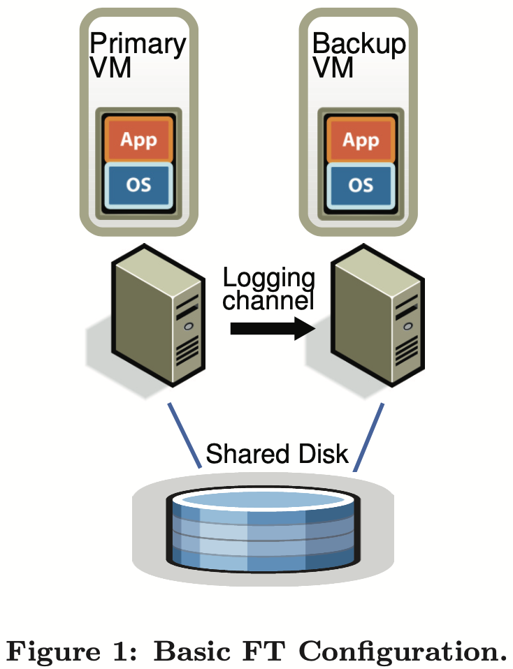

# Purpose

1. Contribution
   - This paper implemented a system providing fault tolerance virtual machine (VM) based on the approach of replicating the execution of a primary VM vis a backup VM on another server. The system automatically restores redundancy after faulure. 
   - It reduces performance of real applications by less than 10%. The data bandwidth needed to keep the primary and secondary VM executing in lockstep is less than 20 Mb/s for several real applications, which allows for the possibility of implementing fault tolerance over longer distance. 
   - The system automatically restores redundancy after a failure by starting a new backup viretual machine on any available server in the local cluster. 
2. Limitation
   - Only support uni-processor VMs. Recording and replaying the execution of a multi-processor VM have significant performance issues because nearly every access to shared memory can be a non-deterministic operation. 
   - Only attempt to deal with fail-stop failure, which are server failures that can be detected before the failing server causes an incorrect externally visible action. 
3. Challenges
   - Correctly capturing all the input and non-determinism necessary to ensure deterministic execution of a backup virtual machine. 
   - Correctly applying the inputs and non-determinism to the backup virtual machine. 
   - Doing so in a manner that doesn't degrade performance. 

# Model

## FT design

### Primary-backup structure

1. **What is the usual way to implement fault-tolerance via primary/backup approach?**

   - The backup server is always available to take over is the primary server fails. 
     - The problem is that the state of the backup server must be kept nearly identical to the primary server at all times. We say that the two VMs are in virtual lock-step. 

   - One way is to ship shcanges to all state of the primary. The bandwidth needed to send can be very large. 
   - Another method is the state-machine approach. 
     - The idea is to model the servers as deterministic state machcines that are kept in sync by starting them from the same initial state and ensuring that they receive the same input requests in the same order. 
     - Some operations are not deterministic. Extra coordination must be used to ensure that they receive a primary and backup are kept in sync. 
     - The extra information is far less than the amount of state (mainly memory updates) that is changing in the primary. 

2. **What is the difference between physical servers and VM in state machine level?**

   - Implementing coordication to ensure deterministic execution of physical servers is difficult, particularly as processor frequencies increase. 
   - VM running on top of a hypervisor can be considered a well-defined state machine. 
   - VMs still have non-deterministic operations. Hypervisor is able to capture all the necessary information about non-deterministic operations on the primary VM and to replay these operations correctly on the backup VM. 

3. **What is the basic structure of FT VMs?**

   - The virtual disks for the VMs are on shared storage, and accessible to the primary and backup VM for input and output. 
   - Only the primary VM advertises its presence on the network, so all network inputs come to the primary VM. So does all other inputs. 
   - All inputs, including incoming network packets, disk reads, keyboard and mouse, only come to the primary VM. And  the primary VM sends all inputs it received to the backup VM via a network connection known as the logging channel. 

   

### FT protocol

1. **How does VMware backup VM replay?**
   - VMware deterministic replay records the inputs of a VM and all possible non-determinism associated with the VM execution in a stream of log entries written to a log file. 
   - For non-deterministic operations, sufficient infomation is logged to allow the operation to be reproduced with the same state change and output. 
   - For non-deterministic events such as timer or IO completion interrupts, the exact instruction at which the event occurred is also recorded. During replay, the event is delivered at the same point in the instruction stream. 
   - VMware deterministic replay has no need to use epochs where non-deterministic events are only delievered at the end. Each interrupt is recorded as it occurs and effciently delivered at the appropriate instruction while being replayed. 
   - Instead of writing the log entries to disk, we send them to the backup VM via the logging channel. The backup VM replays the entries in real time. 
2. **What if the backup VM executes in a way different from the primary VM?**
   - The *Output Requirement*: if the backup VM ever takes over after a failure of the primary, the backup VM will continue executing in a way that is entirely consistent with all outputs that the primary VM has sent to the external world. 
   - The Output Requirement can be ensured by 
     - delaying any external output (typically a network packet) until the backup VM has received all information that will allow it to replay execution at least to the point of that output operation. 
     - One necessary condition is that the backup VM must have received all log entries generated prior to the output operation. 
   - If we create a special log entry at each output operation. Then, the Output Requirement may be enforced by the Output Rule. 
     - *Output Rule*: the primary VM may not send an output to the external world, until the backup VM has received and acknowledged the log entry associated with the operation producing the output. 
3. **Will the Output Rule affect VM, e.g. stop its execution?**
   - It does not say anything about stopping the execution of the primary VM. We need only delay the sending of the output, but the VM itself can continue execution. 
   - Since operating systems do non-blocking network and disk outputs with asynchronous interrupts to indicate completion, the VM can easily continue execution and will not necessarily be immediately affected by the delay in the output. 

### Detecting and responding to failure

1. **How to handle duplicate outputs?**
   - We cannot guarantee that all outputs are produced exactly once in a failover situation. 
   - The network infrastructure (e.g. TCP) is designed to deal with lost packets and duplicate packets. 
2. **How to handle backup VM failure?**
   - The primary VM will go live, i.e. leave recording mode, stop sending entries on the logging channel and start executing normally. 
3. **How to handle primary VM failure?**
   - The backup VM will continue replaying its execution from the log entries until it has consumed the last log entry. 
   - The backup VM will stop replaying mode and start executing as a normal VM. The backup VM has been promoted to the primary VM, and is now missing a backup VM. 
4. **After a failover, how will the new primary VM communicate with external world?**
   - VMware FT automatically advertises the MAC address of the new primary VM on the network, so that physical network switches will know  on what server that new primary VM is located. 
   - The newly promoted primary VM may need to reissue some disk IOs. 
5. **How to detect failure of primary or backup VMs?**
   - VMware FT uses UDP heartbeating between servers that are running fault-tolerant VMs to detect when a server may have crashed. 
   - In addition, VMware FT monitors the logging traffic that is sent from the primary to the backup VM and the acknowledgments sent from the backup VM to the primary VM. Because of regular timer interrupts, the logging traffic should be regular and never stop for a functioning guest OS. 
6. **How to avoid split-brain problems?**
   - When either a primary or backup VM wants to go live, it executes an atomic test-and-set operation on the shared virtual disk. 
   - If the operation succeeds, the VM is allowed to go live. 
   - If the operation fails, then the other VM must have already gone live, so the current VM actually halts itself ("commits suicide"). 

## Implementation

