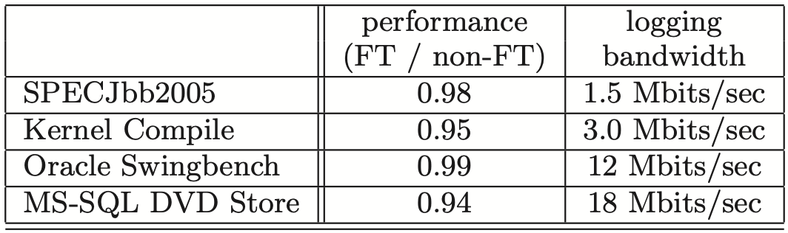
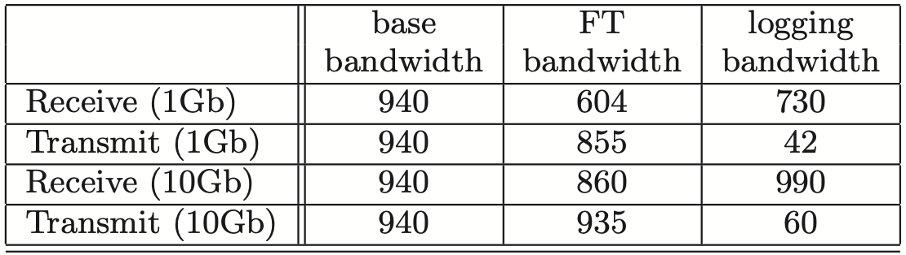

* [Purpose](#purpose)
* [Model](#model)
   * [FT design](#ft-design)
      * [Primary-backup structure](#primary-backup-structure)
      * [FT protocol](#ft-protocol)
      * [Detecting and responding to failure](#detecting-and-responding-to-failure)
      * [Alternative: Non-shared disk](#alternative-non-shared-disk)
   * [Implementation](#implementation)
      * [Starting and restarting](#starting-and-restarting)
      * [Logging channel](#logging-channel)
      * [Special operations](#special-operations)
      * [Issues for disk IOs](#issues-for-disk-ios)
      * [Issues for network IO](#issues-for-network-io)
* [Experiments and results](#experiments-and-results)

# Purpose

1. Contribution
   - This paper implemented a system providing fault tolerance virtual machine (VM) based on the approach of replicating the execution of a primary VM vis a backup VM on another server. The system automatically restores redundancy after faulure. 
   - It reduces performance of real applications by less than 10%. The data bandwidth needed to keep the primary and secondary VM executing in lockstep is less than 20 Mb/s for several real applications, which allows for the possibility of implementing fault tolerance over longer distance. 
   - The system automatically restores redundancy after a failure by starting a new backup viretual machine on any available server in the local cluster. 
2. Limitation
   - Only support uni-processor VMs. Recording and replaying the execution of a multi-processor VM have significant performance issues because nearly every access to shared memory can be a non-deterministic operation. 
   - Only attempt to deal with fail-stop failure, which are server failures that can be detected before the failing server causes an incorrect externally visible action. 
3. Challenges
   - Correctly capturing all the input and non-determinism necessary to ensure deterministic execution of a backup virtual machine. 
   - Correctly applying the inputs and non-determinism to the backup virtual machine. 
   - Doing so in a manner that doesn't degrade performance. 

# Model

## FT design

### Primary-backup structure

1. **What is the usual way to implement fault-tolerance via primary/backup approach?**

   - The backup server is always available to take over is the primary server fails. 
     - The problem is that the state of the backup server must be kept nearly identical to the primary server at all times. We say that the two VMs are in virtual lock-step. 

   - One way is to ship changes to all state of the primary. The bandwidth needed to send can be very large. 
   - Another method is the state-machine approach. 
     - The idea is to model the servers as deterministic state machcines that are kept in sync by starting them from the same initial state and ensuring that they receive the same input requests in the same order. 
     - Some operations are not deterministic. Extra coordination must be used to ensure that they receive a primary and backup are kept in sync. 
     - The extra information is far less than the amount of state (mainly memory updates) that is changing in the primary. 

2. **What is the difference between physical servers and VM in state machine level?**

   - Implementing coordication to ensure deterministic execution of physical servers is difficult, particularly as processor frequencies increase. 
   - VM running on top of a hypervisor can be considered a well-defined state machine. 
   - VMs still have non-deterministic operations. Hypervisor is able to capture all the necessary information about non-deterministic operations on the primary VM and to replay these operations correctly on the backup VM. 

3. **What is the basic structure of FT VMs?**

   - The virtual disks for the VMs are on shared storage, and accessible to the primary and backup VM for input and output. 
   - Only the primary VM advertises its presence on the network, so all network inputs come to the primary VM. So does all other inputs. 
   - All inputs, including incoming network packets, disk reads, keyboard and mouse, only come to the primary VM. And  the primary VM sends all inputs it received to the backup VM via a network connection known as the logging channel. 

   

### FT protocol

1. **How does VMware backup VM replay?**
   - VMware deterministic replay records the inputs of a VM and all possible non-determinism associated with the VM execution in a stream of log entries written to a log file. 
   - For non-deterministic operations, sufficient infomation is logged to allow the operation to be reproduced with the same state change and output. 
   - For non-deterministic events such as timer or IO completion interrupts, the exact instruction at which the event occurred is also recorded. During replay, the event is delivered at the same point in the instruction stream. 
   - VMware deterministic replay has no need to use epochs where non-deterministic events are only delievered at the end. Each interrupt is recorded as it occurs and effciently delivered at the appropriate instruction while being replayed. 
   - Instead of writing the log entries to disk, we send them to the backup VM via the logging channel. The backup VM replays the entries in real time. 
2. **What if the backup VM executes in a way different from the primary VM?**
   - The *Output Requirement*: if the backup VM ever takes over after a failure of the primary, the backup VM will continue executing in a way that is entirely consistent with all outputs that the primary VM has sent to the external world. 
   - The Output Requirement can be ensured by 
     - delaying any external output (typically a network packet) until the backup VM has received all information that will allow it to replay execution at least to the point of that output operation. 
     - One necessary condition is that the backup VM must have received all log entries generated prior to the output operation. 
   - If we create a special log entry at each output operation. Then, the Output Requirement may be enforced by the Output Rule. 
     - *Output Rule*: the primary VM may not send an output to the external world, until the backup VM has received and acknowledged the log entry associated with the operation producing the output. 
3. **Will the Output Rule affect VM, e.g. stop its execution?**
   - It does not say anything about stopping the execution of the primary VM. We need only delay the sending of the output, but the VM itself can continue execution. 
   - Since operating systems do non-blocking network and disk outputs with asynchronous interrupts to indicate completion, the VM can easily continue execution and will not necessarily be immediately affected by the delay in the output. 
4. **What is the subtleties of executing disk reads on the backup VM?**
   - By default, the primary VM will send the results of the disk read to the backup VM via the logging channel. 
   - Executing disk read on the backup VM can greatly reduce the traffic on the logging channel for workloads that do a lot of disk reads. It may also slow down the backup VM's execution. 
   - Some extra work must be done to deal with failed disk read operations. 
     - If the primary succeeds while the backup fails, the backup needs to keep retrying until succeess. 
     - If the backup succeeds while the primary fails, the contents of the target memory must be sent to the backup via the logging channel, since the contents of memory will be undetermined and not necessarily replicated by a successful disk read by the backup VM. 
   - If the primary VM does a read to a particular disk location followed fairly soon by a write to the same disk location, then the disk write must be delayed until the backup VM has executed the first disk read. 

### Detecting and responding to failure

1. **How to handle duplicate outputs?**
   - We cannot guarantee that all outputs are produced exactly once in a failover situation. 
   - The network infrastructure (e.g. TCP) is designed to deal with lost packets and duplicate packets. 
2. **How to handle backup VM failure?**
   - The primary VM will go live, i.e. leave recording mode, stop sending entries on the logging channel and start executing normally. 
3. **How to handle primary VM failure?**
   - The backup VM will continue replaying its execution from the log entries until it has consumed the last log entry. 
   - The backup VM will stop replaying mode and start executing as a normal VM. The backup VM has been promoted to the primary VM, and is now missing a backup VM. 
4. **After a failover, how will the new primary VM communicate with external world?**
   - VMware FT automatically advertises the MAC address of the new primary VM on the network, so that physical network switches will know  on what server that new primary VM is located. 
   - The newly promoted primary VM may need to reissue some disk IOs. 
5. **How to detect failure of primary or backup VMs?**
   - VMware FT uses UDP heartbeating between servers that are running fault-tolerant VMs to detect when a server may have crashed. 
   - In addition, VMware FT monitors the logging traffic that is sent from the primary to the backup VM and the acknowledgments sent from the backup VM to the primary VM. Because of regular timer interrupts, the logging traffic should be regular and never stop for a functioning guest OS. 
6. **How to avoid split-brain problems?**
   - When either a primary or backup VM wants to go live, it executes an atomic test-and-set operation on the shared virtual disk. 
   - If the operation succeeds, the VM is allowed to go live. 
   - If the operation fails, then the other VM must have already gone live, so the current VM actually halts itself ("commits suicide"). 

### Alternative: Non-shared disk

1. **What is the difference between non-shared disk and shared disk?**
   - In shared disk, any write to the shared disk is considered a communication to external world. Writes to the shared disk must be delayed. 
   - In non-shared disk, the virtual disks are essentially considered part of the internal state of each VM. Disk writes of the primary do not have to be delayed according to the Output Rule. 
2. **In what case non-shared disk will be useful?**
   - Shared storage is not accessible to the primary and backup VMs. 
   - This may be the case because shared storage is unavailable or too expensive, or because the servers running the primary and backup VMs are far apart. 
3. **What is the disadvantage of non-shared disk?**
   - The two copies of the virtual disks must be explicitly synced up in some manner when fault tolerance is first enabled. 
   - The disks can get out of sync after a failure, so they must be explicitly resynced when the backup VM is restarted after a failure. 
4. **How to solve the split-brain situation?**
   - There may be no shared storage to use for dealing with it. The system could use some other external tiebreaker. 
     - A third-party server that both servers can talk to. 
   - If the servers are part of a cluster with more than two nodes, the system could alternatively use a majority algorithm. 
     - A VM would only be allowed to go live if it is running on a server that is part of a communication sub-cluster that contains a majority of the original nodes. 

## Implementation

### Starting and restarting

1. **What requirements need to be satisfied by the startup mechanism?**
   - We also want to use it to restart a backup VM after a failure. Hence, this mechanism must be usable for a running primary VM that is in an arbitrary state. 
   - We would prefer that the mechanism does not significantly disrupt that execution of the primary VM. 
2. **How to implement the startup mechanism?**
   - VMware FT adapted a modified VMware VMotion that allows the migration of a running VM from one server to another server with minimal disruption. However, after migration, the VMotion will destroy the local VM. 
   - The FT VMotion clones a VM to a remote host rather than migrating it without destroying the local VM. 
   - The FT VMotion also sets up a logging channel, and causes the source VM to enter logging mode as the primary, and the destination VM to enter replay mode as the new backup. 
3. **How to choose a server on which to run the backup VM?**
   - The primary Vm informs the clustering service that it needs a new backup. 
   - The clustering service determines the best server on which to run the backup VM based on resource usage and other constraints and invokes an FT VMotion to create the new backup VM. 
   - VMware FT typically can re-establish VM redundancy within minutes of a server failure, all without any noticeable interruption in the execution of a fault-tolerant VM. 

### Logging channel

1. **How to control primary sending log entries, and backup receiving entries?**
   - The hypervisors maintain a large buffer for logging entries for the primary and backup VMs. 
   - The contents of the primary's log buffer are flushed out to the logging channel as soon as possible, and log entries are read into the backup's log buffer from the logging channel as soon as they arrive. 
   - The backup sends acknowledgments back to the primary each time that it reads some log entries from the network into its log buffer. 
2. **What if the log buffer of the primary is full?**
   - It must stop execution until log entries can be flushed out. 
   - This stop in execution is a natural flow-control mechanism that slows down the primary VM when it is producing log entries at too fast a rate. 
   - This pause can affect clients of the VM, and we must minimize the possibility that the primary log buffer fills up. 
3. **What is the main cause of the buffer of primary being full?**
   - One biggest reason is that the backup VM is executing too slowly and therefore sonsuming log entries too slowly. 
   - In general, the backup VM must be able to replay an execution at roughly the same speed as sthe primary VM is recording the execution. 
   - The overhead of recording and replaying in VMware deterministic replay is roughly the same. 
   - If the server hosting the backup VM is heavily loaded with other VMs (and hence overcommitted on resources), the backup VM may not be able to get enough CPU and memory resources to execute as fast as the primary VM. 
4. **How to prevent the backup VM from getting too far behind the primary?**
   - When sending acknowledgments, we also send additional information to determine the real-time execution lag between the primary and backup VMs. 
   - Typically the execution lag is less than 100 milliseconds. 
   - If the backup VM starts having a significant execution lag (e.g. more than 1 second), VMware FT starts slowing down the primary VM by informing the scheduler to give it a slightly smally amount of CPU. 
   - Such slowdowns are very rare, and typically happen only when the system is under extreme stress. 

### Special operations

1. **How to deal with control operations?**
   - Most control operations shouls be applied to both machines. 
     - If the primary VM is explicitly powered off, the backup VM should be stopped as well, and not attempt to go live. 
     - Any resource management change on the primary should be applied to the backup. 
   - The only operation that can be done independently on the primary and backup VMs is VMotion. 
     - The primary and backup VMs can be VMotioned independently to other hosts. 
     - VMware FT ensures that neither VM is moved to the server where the other VM is. 
2. **How to implement the VMotion for primary and backup VMs?**
   - For a normal VMotion, it requires that all outstanding disk IOs be quiesced just as the final switchover on the VMotion occurs. 
   - For a primary VM, 
     - The quiescing is easily handled by waiting until the physical IOs completeand delivering these completions to the VM. 
     - The backup VM must disconnect from the source primary and re-connect to the destination primary at the appropriate time. 
   - For a backup VM, 
     - There is no easy way to cause all IOs to be completed at any required point, since the backup VM must replay the primary VM's execution and complete IOs at the same execution point. 
     - When a backup VM is at the final switchover point for a VMotion, it requests via the logging channel that the primary VM temporarily quiesce all its IOs. 

### Issues for disk IOs

1. **How many kind of races may occur?**
   - The first kind is caused by several IO operations. 
     - One reason is that disk operations are non-blocking and can execute in parallel. Simultaneous disk operations access the same disk location causing races. 
     - The other reason is that DMA directly to/from the memory of the VM. Simultaneous disk operations access the same memory pages. 
   - The second kind is caused by IO operations and non-IO operations. 
     - The disk operations directly access the memory of a VM via DMA. Hence a disk operation accesses the same memory pages as an aplication or OS in a VM causing races. 
2. **How to solve the non-determinism caused by several IO operations?**
   - We should detect any such IO races, and force such racing disk operations to execute sequentially in the same way on the primary and backup. 
3. **How to solve the non-determinism caused by IO operations and application/OS?**
   - We need to set up page protection termporarily on pages that are targets of disk operations. 
   - The page protections result in a trap if the VM happens to make an access to a page that is also the target of an outstanding disk operation, and the VM can be paused until the disk operation completes. 
   - Changing MMU protections on pages is expensive, we use bounce buffers. 
     - A bounce buffer is a temporary buffer that has the same size as the memory being accessed by a disk operation. 
     - A disk read operation is modified to read the specified data to the bounce buffer, and the data is copied to guest memory only as the IO completion is delivered. 
     - For a disk write operation, the data to besent is first copied to the bounce buffer, and the disk write is modified to write data from the bounce buffer. 
   - The bounce buffer can slow down disk operations, but noticeable performance loss is not seen. 
4. **How the newly-promoted primary VM handle those outstanding IOs?**
   - There is no way for the newly-promoted primary VM to be sure if the disk IOs were issued to the disk or completed  successfully. 
   - We could send an error completion that indicates that each IO failed, since it is acceptable to return an error even if the IO completed successfully. However, the guest OS might not respond well to errors from its local disk. 
   - We can re-issue the pending IOs during the go-live process of the backup VM. Because we have eliminated all races and all IOs specify derectly which memory and disk blocks are accessed, these disk operations can be re-issued even if they have already completed successfully. 

### Issues for network IO

1. **How to solve the non-determinism caused by asynchronous updates?**
   - In normal VM, the hypervisor asynchronously updating the state of the virtual machine's network device. 
   - For FT
     - The code that asynchronously updates VM ring buffers with incoming packets has been modified to force the guest to trap to the hypervisor, where it can log the updates and then apply them to the VM. 
     - The code that normally pull packets out of transmit queues asynchronously is diabled, and instead transmits are done through a trap to the hypervisor. 
2. **How can we optimize the network performance while running FT? **
   - Reduce VM trapand interrupts with clustering optimizations. 
     - When the VM is streaming data at a sufficient bit rate, the hypervisor can do one transmit trap per group of packets and, in the best case, zero traps, since it can transmit the packets as part of receiving new packets. 
     - The hypervisor can reduce the number of interrupts to the VM for incoming packets by only posting the interrupt for a group of packets. 
   - Reduce the delay for transmitted packets. 
     - The key is to reduce the time required to send a log message to the backup and get an acknowledgment. 
     - It is ensured that sending and receiving log entries and acknowledgments can all be done without any thread context switch. 
     - The VMware vSphere hypervisor allows functions to be registered with the TCP stack that will be called from a deferred-execution context (similar to a tasklet in Linux) whenever TCP data is received. 
     - When the primary VM enqueues a packet to be transmitted, we force an immediate log flush of the associated output log entry by scheduling a defferred-execution context to do the flush. 

# Experiments and results

One important banchmark is the performance ratio between non-FT and FT systems and logging bandwidth between primary and backup. The performance ratio can show how efficient the FT protocol is, and logging bandwidth is usually a bottleneck of the system. The author measured them all as the following table. We can see that FT protocol only decreases the performance by less than 10%

The typical idle logging bandwidth is 0.5-1.5 Mbits/sec. The idle bandwidth is largely the result of recording the delivery of timer interrupts. For a VM with an active workload, the logging bandwidth is dominated by the network and disk inputs that must be sent to the backup - the network packets that are received and the disk blocks that are read from disk. Hence the logging bandwidth can be much higher than those measured in table for applications that have very high network receive or disk read bandwidth. For these kinds of applications, the bandwidth of the logging channel could be a bottleneck. 

The author also measured the bandwidth of logging channels with different capacities, as shown below. When FT is enabled for receive workloads, the loging bandwidth is very large, since all incomming network packets must be sent on the logging channel. When FT is enabled for transmit workloads, the logging bandwidth is much lower. Overall, FT can limit network bandwidths significantly at very high transmit and receive rates, but high absolute rates are still achievable. 

