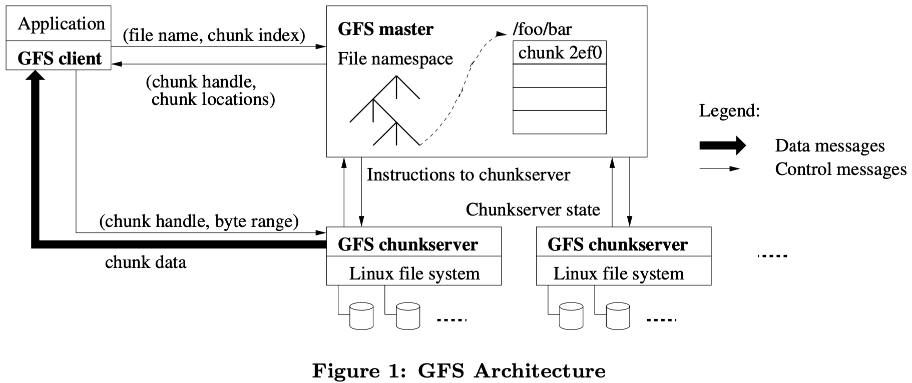
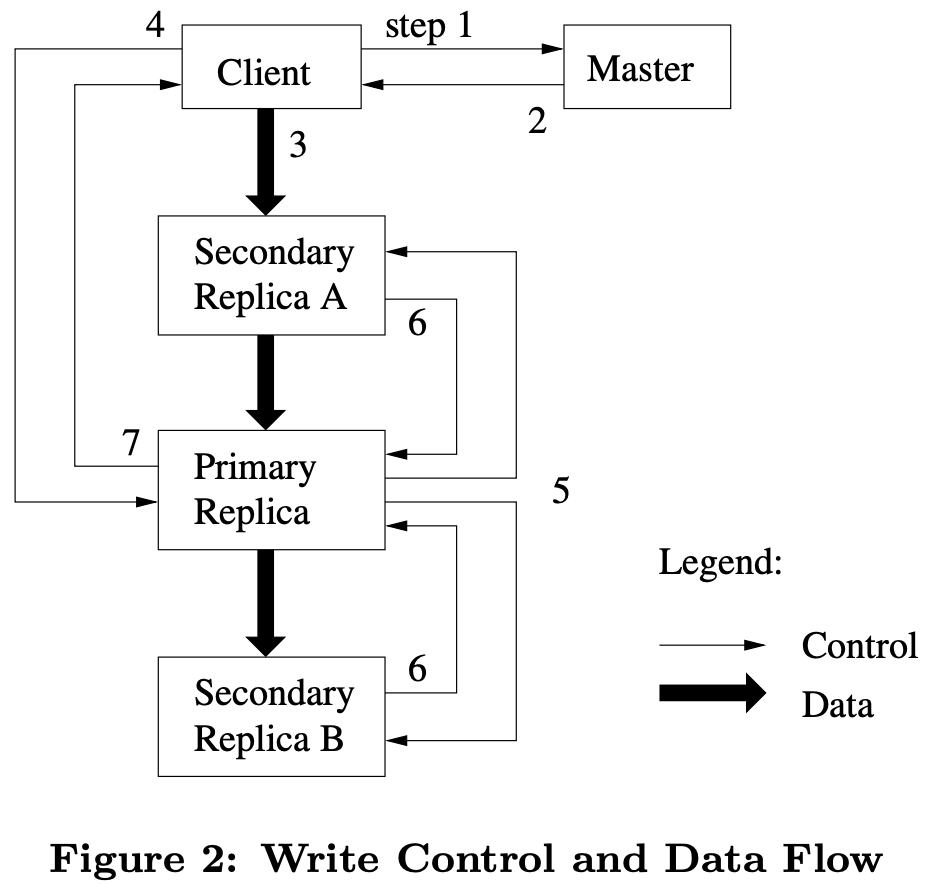
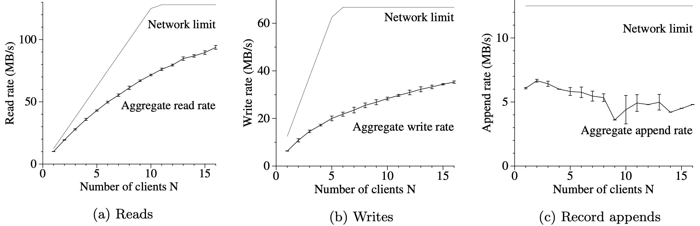
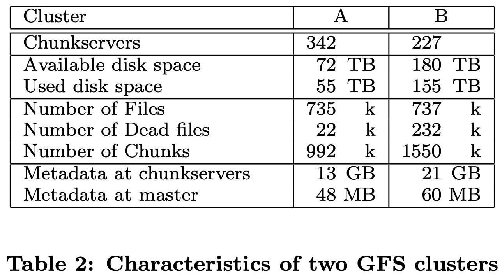
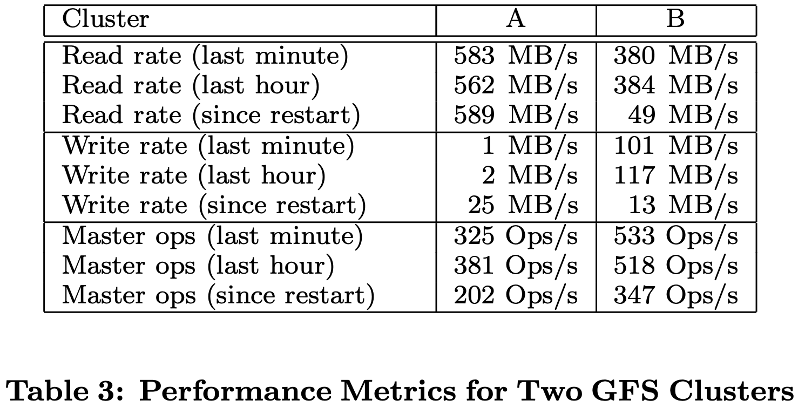
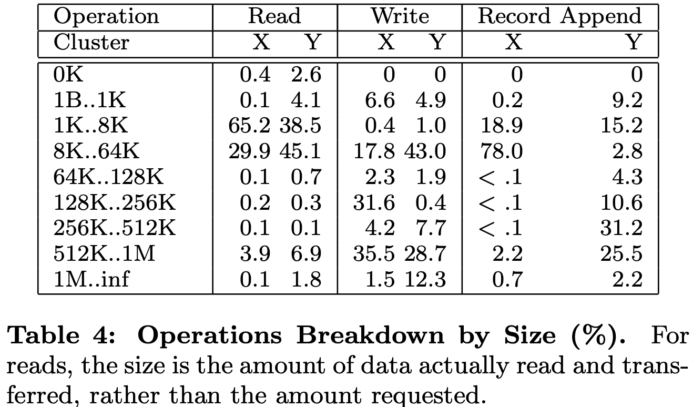
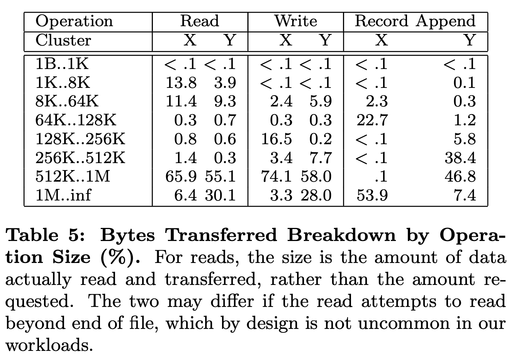
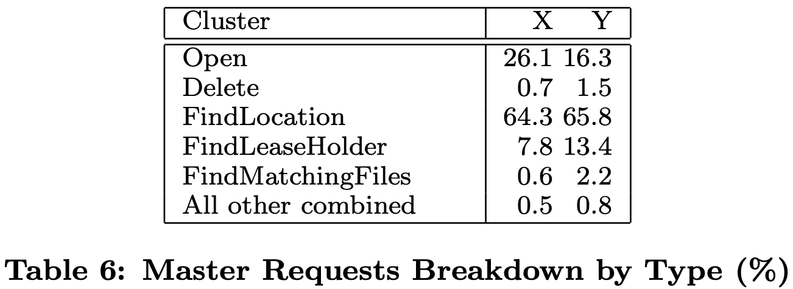

* [Purpose](#purpose)
* [Model](#model)
   * [Overview](#overview)
      * [Architecture](#architecture)
      * [Consistency](#consistency)
   * [Data mutation](#data-mutation)
      * [Control &amp; data flow](#control--data-flow)
      * [Write and record append](#write-and-record-append)
      * [Atomic record appends](#atomic-record-appends)
      * [Snapshot](#snapshot)
   * [Master](#master)
      * [Basic operations](#basic-operations)
      * [Replica management](#replica-management)
      * [Deletion](#deletion)
   * [Fault tolerance](#fault-tolerance)
   * [Other parts (unmentioned)](#other-parts-unmentioned)
* [Experiments and results](#experiments-and-results)
   * [Micro-benchmarks](#micro-benchmarks)
      * [Read](#read)
      * [Write](#write)
      * [Record append](#record-append)
   * [Real world clusters](#real-world-clusters)

# Purpose

1. Contribution: provides fault tolerance while running on inexpensive commodity hardware, and it delivers high aggregate performance to a large number of clients. 
2. Difference points in design space
   - This system integreted constant monitoring, error detection, fault tolerance, and automatic recovery. 
   - Files are huge by traditional standards. Design assumptions and parameters such as I/O operation and block sizes have to be revisited. 
   - Most files are mutated by appending new data rather than overwriting existing data. Random writes within a file are practically non-existent. Once written, the files are only read, and often only seuqentially. 

# Model

## Overview

1. **What operations are supported?**

   - Usual operations: ``create``, ``delete``, ``open``, ``close``, ``read``, and ``write``

   - ``snapshot``: creates a copy of a file or a directory tree at low cost

   - ``record append``: allows multiple clients to append data to the same file concurrently while guaranteeing the atomicity

### Architecture

1. **What does the system consist of?**
    - Consist of a signle *master* and multiple *chunkservers* and is accessed by multiple *clients*. 
    - Files are divided into fixed-size chunks. Each chunk is identified by an immutable and globally unique 64 bit *chunk handle* assigned by the master at the timeof chunk creation. 
    - Chunkservers store chunks on local disks as Linux files and read or write chunk data specified by a chunk handle and byte range. Each chunk is replicated on multiple chunkservers, three by default. 
    - Neither the client nor the chunkserver caches file data. Caches offer little benefit while causing coherence issues. But clients do cache metadata. 
2. **What does master need to do?**
   - The master maintains all file system metadata, and controls system-wide activities. 

     - Metadata includes namespace, access control information, the mapping from files to chunks, and the current locations of chunks. 

     - System-wide activities includes chunk lease management, garbage collection of orphaned chunks, and chunk migration between chunkservers. 
   - The master periodically comminicates with each chunkserver in HeartBeat messages to give it instructions and collect its state. 
   - Clients interact with the master for metadata operations, but all data-bearing communication goes directly to the chunkservers. 
3. **How to prevent the master becoming a bottleneck?**
   - The idea is to minimize its involvement in reads and writes. 
   - A client asks the master which chunkservers it should contact, and caches this information for a limited time and interacts with the chunkservers directly for subsequent operations. 
4. **What is the advantage of large chunk size?**
   - Reduce clients' need to interact with the master because reads and writes on the same chunk require only one initial request to the master for chunk location information. 
   - Reduce network overhead by keeping a persistent TCP connection to the chunkserver over an extended period of time. 
   - Reduce the size of the metadata stored on the master. 
5. **What is the disadvantage of large chunk size?**
   - Wasting space due to internal fragmentation. This can be eased through lazy space allocation. 
   - A small file consists of a small number of chunks, perhaps just one. The chunkservers storing those chunks may become hot spots if many clients are accessing the same file. This have not been a major issue. 
6. **When will hot spots problem emerge?**
   - A more common case is that an executable was written to GFS as a single-chunk file and then started on hundreds of machines at the same time. 
   - We can fix this problem by storing such executables with a higher replication factor. 

### Consistency

1. **How do we define a file region being consistent or defined?**
   - A file region is consistent if all clients will always see the same data, regardless of which replicas they read from. 
   - A region is defined after a file data mutation if it is consistent and clients will see what the mutation writes in its entirety. 
   - Concurrent successful mutations leave the region undefined but consistent: all clients see the same data, but it may not reflect what any one mutation has written. Typically, it consists of mingled fragments from multiple mutations. 
2. **How many consistency rules should be considered?**
   - File namespace mutations (e.g. file creation) are atomic. 
   - After a sequence of successful mutations, the mutated file region is guaranteed to be defined and contain the data written by the last mutation. 
3. **How do GFS guarantees the second rule?**
   - Applying mutations to a chunk in the same order on all its replicas. 
   - Using chunk version numbers to detect any replica that has become stale because it has missed mutations while its chunkserver was down. 
   - Stale replicas will never be involved in a mutation or given to clients asking the master for chunk locations. They are garbage collected at the earliest opportunity. 
4. **What is the side-effect of clients caching chunk locations?**
   - They may read from a stale replica before that information is refreshed.  
   - This window is limited by the cache entry's timeout and dthe next open of the file. 
   - As most of files are append-only, a stale replica usually returns a premature end of chunk rather than outdated data. 

## Data mutation

### Control & data flow

1. **How do we minimize management overhead at the master of data mutation?**

   - We use leases to maintain a consistent mutation order across replicas. 
   - The master grants a chunk lease to one of the replicas, which we call the primary. The primary picks a serial order for all mutations to the chunk. All replicas follow this order when applying mutations. 
   - The client caches who is the lease of a certain chunk for future mutations. It needs to contact the master again only when the primary becomes unreachable or replies that it no longer holds a lease. 

2. **What does leases change?**

   - A lease has an initial timeout of 60 seconds. However, as long as the chunk is being mutated, the primary can request and typically receive extensions from the master indefinitely. 
   - These extension requests and grants are piggybacked on the HeartBeat messages regularly exchanged between the master and all chunkservers. 
   - The master may sometimes try to revoke a lease before it expires (e.g., when the master wants to disable mutations on a file that is being renamed). 
   - Even if the master loses communication with a primary, it can safely grant a new lease to another replica after the old lease expires. 

3. **How does the control flow?**

   - In step 1, the client asks the master which chunkserver holds the current lease for the chunk and the locations of the other replicas. If no one has a lease, the master grants one to a replica it chooses
   - In step 2, the master replies with the identity of the primary and the locations of the other (secondary) replicas. 
   - In step 3, The client pushes the data to all the replicas in any order, instead of only sending to the lease. 
   - In step 4, once all the replicas have acknowledged receiving the data, the client sends a write request to the primary. 
   - In step 5, the primary forwards the write request to all secondary replicas. 
   - In step 6, the secondaries all reply to the primary indicating that they have completed the operation. 
   - In step 7, the primary replies to the client. Any errors encountered at any of the replicas are reported to the client. 

   

4. **How does primary and secondary servers write data?**

   - Each chunkserver will store the data from client in an internal LRU buffer cache until the data is used or aged out. 
   - The write request from client to primary identifies the data pushed earlier to all of the replicas. 
   - The primary assigns consecutive serial numbers to all the mutations it receives, possibly from multiple clients, which provides the necessary serialization. 
   - The primary applies the mutation to its own local state in serial number order. 

5. **What would the system do if write fails?**

   - If it had failed at the primary, it would not have been assigned a serial number and forwarded. 
   - In other cases, the write may have succeeded at the primary and an arbitrary subset of the secondary replicas. The client request is considered to have failed, and the modified region is left in an inconsistent state. 
   - The client code handles such errors by retrying the failed mutation. It will make a few attempts at steps 3 through 7 before falling back to a retry from the beginning of the write. 

6. **What if a write is large or straddles a chunk boundary?**

   - GFS client code breaks it down into multiple write operations. 
   - They all follow the control flow described above but may be interleaved with and overwritten by concurrent operations from other clients. 
   - The shared file region may end up containing fragments from different clients, although the replicas will be identical because the individual operations are completed successfully in the same order on all replicas. 

7. **How to prevent primary become bottleneck of pushing data?**

   - While control flows from the client to the primary and then to all secondaries, data is pushed linearly along a carefully picked chain of chunkservers in a pipelined fashion. 
   - By decoupling the data flow from the control flow, we can improve performance by scheduling the expensive data flow based on the network topology regardless of which chunkserver is the primary. 
   - Our goals are to fully utilize each machine’s network bandwidth, avoid network bottlenecks and high-latency links, and minimize the latency to push through all the data. 
   - Each machine forwards the data to the “closest” machine in the network topology that has not received it. 
   - Our network topology is simple enough that “distances” can be accurately estimated from IP addresses.

8. **How to minimize latency of pushing data?**

   - We minimize latency by pipelining the data transfer over TCP connections. Once a chunkserver receives some data, it starts forwarding immediately. 
   - Pipelining is especially helpful to us because we use a switched network with full-duplex links. Sending the data immediately does not reduce the receive rate. 

### Write and record append

1. **What is the difference between write and record append?**
   - A write causes data to be written at an application-specified file offset. 
   - A record append causes data (the “record”) to be appended atomically at least once even in the presence of concurrent mutations, but at an offset of GFS’s choosing. 
     - The offset is returned to the client and marks the beginning of a defined region that contains the record. 
     - GFS may insert padding or record duplicates in between. They occupy regions considered to be inconsistent and are typically dwarfed by the amount of user data. 
   - A “regular” append is merely a write at an offset that the client believes to be the current end of file. 
2. **How does typical writing happen?**
   - A writer generates a file from beginning to end. It atomically renames the file to a permanent name after writing all the data, or periodically checkpoints how much has been successfully written. 
   - Checkpoints may also include application-level checksums. Readers verify and process only the file region up to the last checkpoint, which is known to be in the defined state. 
   - Checkpointing allows writers to restart incrementally and keeps readers from processing successfully written file data that is still incomplete. 
3. **How does readers deal with occasional padding and duplicates?**
   - Each record prepared by the writer contains extra information like checksums so that its validity can be verified. 
   - A reader can identify and discard extra padding and record fragments using the checksums. 
   - If it cannot tolerate the occasional duplicates, it can filter them out using unique identifiers in the records, which are often needed anyway to name corresponding application entities such as web documents. 

### Atomic record appends

1. **What if appending causes the current chunk to exceed the maximum size?**
   - The primary checks to see if appending the record to the current chunk would cause the chunk to exceed the maximum size. 
   - If so, it pads the chunk to the maximum size, tells secondaries to do the same, and replies to the client indicating that the operation should be retried on the next chunk. 
   - If the record fits within the maximum size, which is the common case, the primary appends the data to its replica, tells the secondaries to write the data at the exact offset where it has, and finally replies success to the client. 
2. **What if appending fails at some chunkservers?**
   - Replicas of the same chunk may contain different data possibly including duplicates of the same record in whole or in part. 
   - GFS does not guarantee that all replicas are bytewise identical. It only guarantees that the data is written at least once as an atomic unit. 
   - If there is any secondary chunkserver that can successfully append the record, the primary is succeed. Next time, the primary can choose an offset after the failed record. 
   - Hence, after this, all replicas are at least as long as the end of record and therefore any future record will be assigned a higher offset or a different chunk even if a different replica later becomes the primary. 

### Snapshot

1. **What does snapshot do?**
   - The snapshot operation makes a copy of a file or a directory tree (the “source”) almost instantaneously, while minimizing any interruptions of ongoing mutations. 
   - Users use it to quickly create branch copies of huge data sets (and often copies of those copies, recursively), or to checkpoint the current state before experimenting with changes that can later be committed or rolled back easily. 
2. **How does snapshot be implemented?**
   - It use standard copy-on-write techniques. 
   - Master revokes leases on the chunks in the files it is about to snapshot. 
     - This ensures that any subsequent writes to these chunks will require an interaction with the master to find the lease holder. 
     - And this will give the master an opportunity to create a new copy of the chunk first.
   - Master logs the operation to disk. 
   - It then applies this log record to its in-memory state by duplicating the metadata for the source file or directory tree. The newly created snapshot files point to the same chunks as the source files. 
3. **How does clients write a chunk after snapshot?**
   - The first time a client wants to write to a chunk C after the snapshot operation, it sends a request to the master to find the current lease holder. 
   - The master notices that the reference count for chunk C is greater than one. It defers replying to the client request and instead picks a new chunk handle C’. 
   - It then asks each chunkserver that has a current replica of C to create a new chunk called C’. 
   - By creating the new chunk on the same chunkservers as the original, we ensure that the data can be copied locally, not over the network. 
   - The master grants one of the replicas a lease on the new chunk C’ and replies to the client, which can write the chunk normally. 

## Master

### Basic operations

1. **How does client communicate with master specifically?**
   - The client translates the file name and byte offset specified by the application into a chunk index within the file. 
   - It sends the master a requeust containing the file name and chunk index. 
   - The master replies with the corresponding chunk handle and locations of the replicas. 
   - The client caches this information using the file name and chunk index as the key. 
2. **What metadata does master need to store?**
   - Stored persistently: the file and chunk namespace, the mapping from files to chunks
     - The master will scan periodically through its entire state in the background
     - Periodic scanning is to implement chunk garbage collection, re-replication in the presence of chunkserver failures, and chunk migration to balance load and disk space usage across chunkservers. 
     - The number of chunks and hence the capacity of the whole system is limited by how much memory the master has. But not a serious limitation for less than $64$ bytes of metadata for each chunk. 
   - No need to store persistently: the locations of each chunk's replicas. 
     - The master asks each chunkserver about its chunks at master startup and whenever a chunkserver joins the cluster. 
     - The master can keep itself up-to-date thereafter because it controls all chunk placement and monitors chunkserver status. 
   - Operation record
     - The namespace and mapping are kept persistent by logging mutations to operation log
     - It is stored on the master's local disk and replicated on remote machines
3. **How to persist?**
   - Operation log
     - The operation log contains a historical record of critical metadata changes. Not only is it the only persistent record of critical metadata, it also serves as a logical time line that defines the order of concurrent operations. 
     - The system respond to a client operation only after flushing the corresponding log record to disk both locally and remotely. 
     - The master batches several log records together before flushing thereby reducing the impact of flushing and replication on overall system thoughput. 
   - Checkpoint
     - To minimize startup time, we must keep the log small. The master checkpoints its state whenever the log grows beyond a certain size. It can recover by loading the latest checkpoint and replaying only the records after that. 
     - The checkpoint is in a compact B-tree like form. 
     - The master switches to a new log file and creates the new checkpoint in a separate thread. 
     - Older checkpoints and log files can be freely deleted, though we keep a few around to guard against catastrophes. A failure during checkpointing does not affect correctness because the recovery code detects and skips incomplete checkpoints. 
4. **How does GFS manage namespace?**
   - GFS does not have a per-directory data structure that lists all the files in that directory. Nor does it support aliases for the same file or directory. 
   - GFS logically represents its namespace as a lookup table mapping full pathnames to metadata. With prefix compression, this table can be efficiently represented in memory. 
   - Each node in the namespace tree (either an absolute file name or an absolute directory name) has an associated read-write lock. 
5. **How does GFS design locking scheme?**
   - If a master operation involves a certain file or directory, it will acquire read-locks on all the parent directories, and either a read-lock or a write-lock on the leaf file or directory that it will operate directly. 
   - File creation does not require a write lock on the parent directory because there is no "directory", or inode-like, data structure to be protected from modification. 
   - This locking scheme allows concurrent mutations in the same directory. 

### Replica management

1. **How to place replicas?**
   - There are two purposes: maximize data reliability and availability, and maximize network bandwidth utilization. 
   - It is not enough to spread replicas across machines, which only guards against disk or machine failures and fully utilizes each machine’s network bandwidth. 
   - We must also spread chunk replicas across racks. This ensures that some replicas of a chunk will survive and remain available even if an entire rack is damaged or offline. It also means that traffic, especially reads, for a chunk can exploit the aggregate bandwidth of multiple racks. 
   - On the other hand, write traffic has to flow through multiple racks, a tradeoff we make willingly. 
   - An even safer way is to spread across data centers in different cities. It can guards against a city-level catastrophe. 
2. **What factors are considered when create a new chunk?**
   - We want to place new replicas on chunkservers with below-average disk space utilization. Over time this will equalize disk utilization across chunkservers. 
   - We want to limit the number of “recent” creations on each chunkserver. Although creation itself is cheap, it reliably predicts imminent heavy write traffic because chunks are created when demanded by writes. 
   - We want to spread replicas of a chunk across racks. 
3. **What if the number of available replicas of a chunk falls below a user-specified goal?**
   - The master would re-replicate the chunk. 
   - If there are many chunks below their goal, the master picks the highest priority chunk considering some factors and “clones” it by instructing some chunkserver to copy the chunk data directly from an existing valid replica. 
     - How far it is from its replication goal. 
     - Prefer to first re-replicate chunks for live files as opposed to chunks that belong to recently deleted files. 
     - To minimize the impact of failures on running applications, we boost the priority of any chunk that is blocking client progress. 
4. **What if cloning traffic from overwhelming client traffic?**
   - The master limits the numbers of active clone operations both for the cluster and for each chunkserver. 
   - Each chunkserver limits the amount of bandwidth it spends on each clone operation by throttling its read requests to the source chunkserver.
5. **How to keep the placement of replicas in balance?**
   - It examines the current replica distribution and moves replicas for better disk space and load balancing. 
   - The master gradually fills up a new chunkserver rather than instantly swamps it with new chunks and the heavy write traffic that comes with them. 
   - The master must also choose which existing replica to remove. It prefers to remove those on chunkservers with below-average free space. 

### Deletion

1. **How to delete a file?**
   - GFS does not immediately reclaim the available physical storage, it is just renamed to a hidden name that includes the deletion timestamp. It does so only lazily during regular garbage collection at both the file and chunk levels. 
   - During the master’s regular scan of the file system namespace, it removes any such hidden files if they have existed for more than three days (the interval is configurable). 
     - Until then, the file can still be read under the new, special name and can be undeleted by renaming it back to normal. 
     - When the hidden file is removed from the namespace, its in-memory metadata is erased. This effectively severs its links to all its chunks.
   - In a similar regular scan of the chunk namespace, the master identifies orphaned chunks (i.e., those not reachable from any file) and erases the metadata for those chunks. 
     - In a HeartBeat message exchanged with the master, each chunkserver reports a subset of the chunks it has, and the master replies with the identity of all chunks that are no longer present in the master’s metadata. 
     - The chunkserver is free to delete its replicas of such chunks. 
2. **What are the advantages and disadvantages of lazy deletion over eager deletion?**
   - It is simple and reliable in a large-scale distributed system where component failures are common. 
   - It merges storage reclamation into the regular background activities of the master. 
   - The delay in reclaiming storage provides a safety net against accidental, irreversible deletion. 
   - The delay sometimes hinders user effort to fine tune usage when storage is tight. 
   - Applications that repeatedly create and delete temporary files may not be able to reuse the storage right away. 
3. **How to address the issues of reusing?**
   - Expediting storage reclamation if a deleted file is explicitly deleted again. 
   - Allow users to apply different replication and reclamation policies to different parts of the namespace. 
4. **How to handle the possible stale replicas?**
   - For each chunk, the master maintains a chunk version number to distinguish between up-to-date and stale replicas. 
   - Whenever the master grants a new lease on a chunk, it increases the chunk version number and informs the up-to-date replicas. This occurs before any client is notified and therefore before it can start writing to the chunk. 
   - If one replica is currently unavailable, its chunk version number will not be advanced. The master will detect that this chunkserver has a stale replica when the chunkserver restarts and reports its set of chunks and their associated version numbers. 
   - The master removes stale replicas in its regular garbage collection. Before that, it effectively considers a stale replica not to exist at all when it replies to client requests for chunk information. 
   - The master includes the chunk version number when it informs clients which chunkserver holds a lease on a chunk or when it instructs a chunkserver to read the chunk from another chunkserver in a cloning operation. 

## Fault tolerance

1. **How to handle master failure?**

   - The master state is replicated for reliability. 
     - When it fails, it can restart almost instantly. 
     - When its machine or disk fails, monitoring infrastructure outside GFS starts a new master process elsewhere with the replicated operation log. 
     - Clients use only the canonical name of the master, which is a DNS alias that can be changed if the master is relocated to another machine.
   - “Shadow” masters provide read-only access to the file system even when the primary master is down. 
     - They enhance read availability for files that are not being actively mutated or applications that do not mind getting slightly stale results. 
     - Since file content is read from chunkservers, applications do not observe stale file content. What could be stale within short windows is file metadata. 
     - To keep itself informed, a shadow master reads a replica of the growing operation log and applies the same sequence of changes to its data structures exactly as the primary does.
     - It depends on the primary master only for replica location updates resulting from the primary’s decisions to create and delete replicas.

2. **Why cannot recover data using other chunk replicas? Why each chunkserver must independently verify the integrity?**

   - It would be impractical to detect corruption by comparing replicas across chunkservers. 
   - Divergent replicas may be legal: the semantics of GFS mutations, in particular atomic record append, does not guarantee identical replicas. 

3. **How to ensure data integrity?**

   - Each chunkserver uses checksumming to detect corruption of stored data. A chunk is broken up into 64 KB blocks. Each has a corresponding 32 bit checksum. 
   - Checksums are kept in memory and stored persistently with logging, separate from user data. 
   - During idle periods, chunkservers can scan and verify the contents of inactive chunks. 

4. **How to read data with checksum?**

   - the chunkserver verifies the checksum of data blocks that overlap the read range before returning any data to the requester, whether a client or another chunkserver. 

   - If a block does not match the recorded checksum, the chunkserver returns an error to the requestor and reports the mismatch to the master. 
   - In response, the requestor will read from other replicas, while the master will clone the chunk from another replica. 
   - After a valid new replica is in place, the master instructs the chunkserver that reported the mismatch to delete its replica. 

5. **How to write data with checksum?**

   - For writes that append to the end of a chunk, we just incrementally update the checksum for the last partial checksum block, and compute new checksums for any brand new checksum blocks filled by the append. 
     - Even if the last partial checksum block is already corrupted and we fail to detect it now, the new checksum value will not match the stored data, and the corruption will be detected as usual when the block is next read.
   - If a write overwrites an existing range of the chunk, we must read and verify the first and last blocks of the range being overwritten, then perform the write, and finally compute and record the new checksums. 
     - If we do not verify the first and last blocks before overwriting them partially, the new checksums may hide corruption that exists in the regions not being overwritten. 

6. **What is included in the diagnostic logs?**

   - GFS servers generate diagnostic logs that record many significant events (such as chunkservers going up and down) and all RPC requests and replies. 
   - The RPC logs include the exact requests and responses sent on the wire, except for the file data being read or written. 

## Other parts (unmentioned)

1. **To sum up, what is the metadata of master, and where are they?**
   - File name: this is an array of chunk handles. It is stored on disk. 
   - Handle: it contains a list of chunkservers, version number, primary, and lease expiration. 
     - Only the version number is stored on disk, due to the rest can be restored by asking chunkservers when master is recovered. 
     - Given that there might have stale chunks, we cannot ask chunkservers for the version number of a chunk. 
   - Lops and checkpoints are stored on disk. 
2. **What is the cause of split brain? How to solve it?**
   - Split brain is caused by network partition, the master cannot talk to primary while the primary can talk to clients. Hence the master mistakingly designates two primary for the same chunk. 
   - The master knowswhen the lease will expire, so when the master cannot talk to the primary, it will wait until the lease expired before assign another primary. 
3. **Why GFS doesn't overwrite those failed records immediately, but leaving padding and duplicates?**
   - Because When it starts to write the next record, it may not know the fate of prior record. 
4. **GFS is a weak consistency system, how can we upgrade it to a strong consistency system?**
   - Primary detects duplicate requests to ensure the failed write doesn't show up twice
   - When primary asks a secondary to do something, the secondary actually does it and doesn't just return error (except the secondary has a permanent damage, in which case, it should be removed)
   - The secondary doesn't expose data to readers until the primary is sure that all the secondaries really will be execute the append. 
   - When primary crashes, there will have been some last set of operations that primary had launched to the secondaries, but primary crashed before ensure all operations are done. The new primary need to explicitly resync with all secondaries. 

# Experiments and results

## Micro-benchmarks

The author first tested several micro-benchmarks, i.e. reads, writes, and record appends. These tests are that $N$ clients do those operation simultaneously. For reading, they read from the file system; for writing, they write to distinct files; for appending, they append to a single file. And test the aggregate throughputs of the system, comparing them with the network limit. The results are as following: 

### Read

The reading efficiency drops because as the number of readers increases, so does the probability that multiple readers simultaneously read from the same chunkserver. 

### Write

The limit plateaus of write rate at 67 MB/s because we need to write each byte to 3 of the 16 chunkservers, each with a 12.5 MB/s input connection. 

The main culprit for a low write rate with only one client is the network stack. It does not interact very well with the pipelining scheme we use for pushing data to chunk replicas. Delays in propagating data from one replica to another reduce the overall write rate. 

As the number of clients grows, it becomes more likely that multiple clients write concurrently to the same chunkserver as the number of clients increases. Moreover, collision is more likely for 16 writers than for 16 readers because each write involves three different replicas. 

Writes are slower than we would like. In practice this has not been a major problem because even though it increases the latencies as seen by individual clients, it does not significantly affect the aggregate write bandwidth delivered by the system to a large number of clients. 

### Record append

The performance of record appends is limited by the network bandwidth of the chunkservers that store the last chunk of the file, independent of the number of clients. 

The append rate drops mostly due to congestion and variances in network transfer rates seen by different clients. 

The chunkserver network congestion in our experiment is not a significant issue in practice because a client can make progress on writing one file while the chunkservers for another file are busy. 

## Real world clusters

The author also measured the performance of real world clusters. First, the author measured their storage usage and size of metadata. Then, the read rate, write rate and the rate of operations sent to the master were measured. The results show that master can easily keep up with this rate, and therefore is not a bottleneck for these workloads. 

After a chunkserver fails, some chunks will become underreplicated and must be cloned to restore their replication levels. To test the recovery time, the author killed a single chunkserver containing 15000 chunks of 600 GB data. 

To limit the impact on running applications and provide leeway for scheduling decisions, our default parameters limit this cluster to 91 concurrent clonings (40% of the number of chunkservers) where each clone operation is allowed to consume at most 6.25 MB/s (50 Mbps). All chunks were restored in 23.2 minutes, at an effective replication rate of 440 MB/s. 

Finally, the author also measured the workload of chunkserver and master, and breakdown the workload of chunkserver by size and same of master by type. The table 4 shows the distribution of operations by size, and the table 5 shows the total amount of data transferred in operations of various size. 

