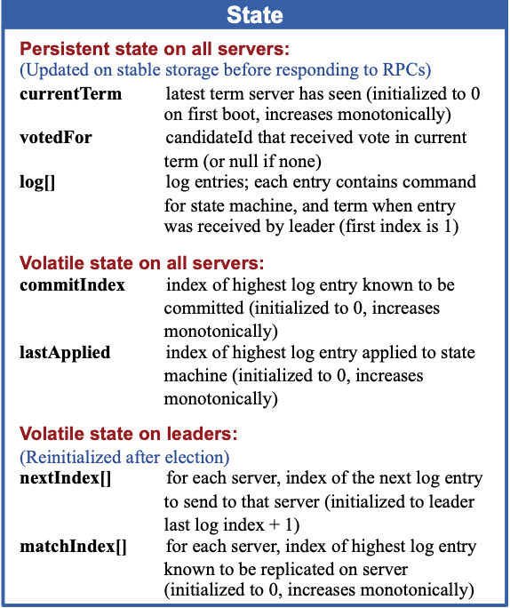

# Purpose

1. Enhance the understandability of Paxos
   - Raft separates the key elements of consensus, such as leader election, log replication, and safety
   - It enforces a stronger degree of coherency to reduce the number of states that must be considered
2. Novel features: strong leader, leader election, membership changes. 
3. **What is the common properties of consensus algorithms?**
   - Safety: never returning an incorrect result under all non-Byzantine conditions, including network delays, partitions, and packet loss, duplica- tion, and reordering.
   - Available as long as any majority of the servers are operational and can communicate with each other and with clients. 
   - They do not depend on timing to ensure the consistency of the logs: faulty clocks and extreme message delays can, at worst, cause availability problems. 
   - A command can complete as soon as a majority of the cluster has responded to a single round of remote procedure calls; a minority of slow servers need not impact overall system performance. 

# Model

## Basics

1. **How does Raft implements consensus overall?**
   - First electing a distin- guished leader, then giving the leader complete responsi- bility for managing the replicated log. 
   - The leader accepts log entries from clients, replicates them on other servers, and tells servers when it is safe to apply log entries to their state machines. 
   - A leader can fail or be- come disconnected from the other servers, in which case a new leader is elected.
2. **What are the states of each server?**
   - At any given time each server is in one of three states: leader, follower, or candidate. 
   - In normal operation there is exactly one leader and all of the other servers are followers. 
   - Followers are passive: they issue no requests on their own but simply respond to requests from leaders and candidates. 
   - The leader handles all client requests. If a client contacts a follower, the follower redirects it to the leader. 
   - The candidate is used to elect a new leader. 
3. **How to divide the terms?**
   - Terms are numbered with consecutive integers. Each election begins a new term. 
   - If an election results in a split vote, the term will end with no leader; a new term with a new election will begin shortly. 
   - Terms act as a logical clock in Raft, and they allow servers to detect obsolete information such as stale leaders. 
4. **How does terms change?**
   - Each server stores a current term number, which increases monotonically over time. 
   - Current terms are exchanged whenever servers communicate; if one server’s current term is smaller than the other’s, then it updates its current term to the larger value. 
   - If a candidate or leader discovers that its term is out of date, it immediately reverts to fol- lower state. 
   - If a server receives a request with a stale term number, it rejects the request. 
5. **How does Raft handle follower and candidate crashes?**
   - If a follower or candidate crashes, then fu- ture RequestVote and AppendEntries RPCs sent to it will fail. Raft handles these failures by retrying indefinitely. 
   - If a server crashes after completing an RPC but before responding, then it will receive the same RPC again after it restarts. Raft RPCs are idempotent, i.e. servers will ignore the RPCs that is already handled, so this causes no harm. 

### States stored on servers

1. Persistent state on all servers: These states need to be updated on stable storage before responding to RPCs, i.e. communicating with outside. 
   - ``currentTerm``: latest term server has seen (initialized to 0 on first boot, increases monotonically)
   - ``votedFor``: candidateId that received vote in current term (or ``null`` if none)
   - ``log[]``: log entries
2. Volatile state on all servers:
   - ``commitIndex``: index of highest log entry known to be committed (initialized to 0, increases monotonically)
   - ``lastApplied``: index of highest log entry applied to state machine (initialized to 0, increases monotonically)

3. Volatile state on leaders: These states need to be reinitialized after election
   - ``nextIndex[]``: for each server, index of the next log entry to send to that server (initialized to leader last log index + 1)
   - ``matchIndex[]``: for each server, index of highest log entry known to be replicated on server (initialized to 0, increases monotonically)

## Leader election

1. **How does the servers states transit?**

   - When servers start up, they begin as followers. A server remains in follower state as long as it receives valid RPCs from a leader or candidate. 
   - Leaders send periodic heartbeats (AppendEntries RPCs that carry no log entries) to all followers in order to maintain their authority. 
   - If a follower receives no communication over a period of time called the election timeout, then it assumes there is no vi- able leader and become a candidate to initiate a new election. 
   - A candidate that receives votes from a majority of the full cluster becomes the new leader. 

   

2. **How to elect a leader?**

   - To begin an election, a follower increments its current term and transitions to candidate state. 
   - It then votes for itself and issues RequestVote RPCs in parallel to each of the other servers in the cluster. 
   -  Candidate continues in this state until one of three things happens
     - It wins the election
     - Another server establishes itself as leader
     - A period of time goes by with no winner. 

3. **How is the election held?**

   - Each server will vote for at most one candidate in a given term, on a first-come-first-served basis to ensure that at most one candidate can win the election for a particular term. 
   - A candidate wins an election if it receives votes from a majority of the servers in the full cluster for the same term. 
   - Once a candidate wins an election, it becomes leader. It then sends heartbeat messages to all of the other servers to establish its authority and prevent new elections. 

4. **How to determine that a server loses the election?**

   - A candidate may receive an AppendEntries RPC from another server claiming to be leader. 
   - If the leader’s term is at least as large as the candidate’s current term, then the candidate recognizes the leader as legitimate and returns to follower state. 
   - If the term in the RPC is smaller than the candidate’s current term, then the candidate rejects the RPC and con- tinues in candidate state. 

5. **How to handle a split vote?**

   - If many followers become candidates at the same time, votes could be split so that no candidate obtains a majority. 
   - Each candidate will time out and start a new election by incre- menting its term and initiating another round of Request- Vote RPCs. 
   - Raft uses randomized election timeouts to ensure that split votes are rare and that they are resolved quickly. 
     - Election timeouts are chosen randomly from a fixed interval at the start of an election, and it waits for that timeout to elapse before starting the next election. 
     - In most cases only a single server will time out; it wins the election and sends heartbeats before any other servers time out. 

6. **How to ensure that the leader of any given term contains all of the entries committed in previous terms?**

   - A candidate must contact a majority of the cluster in order to be elected, which means that every committed entry must be present in at least one of those servers. 
   - If the candidate’s log is at least as up-to-date as any other log in that majority， then it will hold all the committed entries. 
   - In the RequestVote RPC, the voter denies its vote if its own log is more up-to-date than that of the candidate. 
   - Raft determines which of two logs is more up-to-date by comparing the index and term of the last entries in the logs. 
     - If the logs have last entries with different terms, then the log with the later term is more up-to-date. 
     - If the logs end with the same term, then whichever log is longer is more up-to-date. 

7. **What is the limitation of broadcast time and election timeout?**

   - $broadcastTime\ll electionTimeout\ll MTBF$
   - BbroadcastTime is the average time it takes a server to send RPCs in parallel to every server in the cluster and receive their responses. electionTime- out is the election timeout. MTBF is the average time between failures for a single server. 
   - The broadcast time should be an order of mag- nitude less than the election timeout so that leaders can reliably send the heartbeat messages required to keep fol- lowers from starting elections. 
   - The election timeout should be a few orders of magnitude less than MTBF so that the sys- tem makes steady progress. 

### RequestVote RPC

1. This is invoked by candidates to gather votes. 
2. Arguments: 
   - ``term``: candidate's term
   - ``candidateId``: candidate requesting vote
   - ``lastLogIndex``: index of candidate's last log entry
   - ``lastLogTerm``: term of candidate's last log entry
3. Results: 
   - ``term``: currentTerm, for candidate to update itself
   - ``voteGranted``: true means candidate received vote
4. Receiver implementation:
   - Reply ``false`` if ``term < currentTerm``
   - If votedFor is ``null`` or ``candidateId``, and candidate's log is at least as up-to-date as receiver's log, grant vote

## Log replication

1. **How is clients request handled?**

   - Each client request contains a command to be executed by the replicated state machines. 
   - The leader appends the command to its log as a new entry, then is- sues AppendEntries RPCs in parallel to each of the other servers to replicate the entry. 
   - When the entry has been safely replicated, the leader applies the entry to its state machine and returns the result of that execution to the client. 
   - If followers crash or run slowly, or if network packets are lost, the leader retries Append- Entries RPCs indefinitely (even after it has responded to the client) until all followers eventually store all log en- tries.

2. **What is stored in a log entry?**

   - A command for state machine
   - A term number when entry was received by leader. 
   - An index to identify its position in the log. The index of the first log is 1. 

3. **How to apply a log entry to the state machines?**

   - The leader decides when it is safe to apply a log en- try to the state machines. 
     - Such an entry is called ``commit- ted``. 
     - Raft guarantees that committed entries are durable and will eventually be executed by all of the available state machines. 
   - A log entry is committed once the leader that created the entry has replicated it on a majority of the servers. 
   - It also commits all preceding entries in the leader’s log, including entries created by previous leaders. 
   - The leader keeps track of the highest index it knows to be committed, and it includes that index in future AppendEntries RPCs, including heartbeats, so that the other servers eventually find out that they should commit some new entries. 
   - Once a follower learns that a log entry is committed, it applies the entry to its local state machine in log order. 

4. **How to determine the consistency between logs?**

   - **Log Matching property**: If two logs contain an entry with the same index and term, then the logs are identical in all entries up through the given index. 

   - The Log Matching property is maintained through the following properties: 

     - If two entries in different logs have the same index and term, then they store the same command. 

     - If two entries in different logs have the same index and term, then the logs are identical in all preceding entries. 

5. **How to check the consistency in AppendEntries RPCs?**

   - When send- ing an AppendEntries RPC, the leader includes the index and term of the entry in its log that immediately precedes the new entries. 
   - If the follower does not find an entry in its log with the same index and term, then it refuses the new entries. 

6. **What kinds of inconsistency may incur?**

   - Leader crashes can leave the logs inconsistent. The old leader may not have fully replicated all of the entries in its log. 
   - A follower may be missing entries that are present on the leader, it may have extra entries that are not present on the leader, or both. 

7.  **How does leader handle follower inconsistencies?**

   - **Leader Append-Only** property: a leader never overwrites or deletes entries in its log. 
   - The leader handles inconsistencies by forcing the followers' logs to duplicate its own. Namely, conflicting entries in follower logs will be overwritten with entries from the leader's log. 
   - The leader must find the latest log entry where the two logs agree, delete any entries in the follower’s log after that point, and send the follower all of the leader’s entries after that point. 
   - All of these actions happen in response to the consistency check performed by AppendEntries RPCs. 
   - A leader does not need to take any special actions to restore log consistency when it comes to power. It just begins normal operation, and the logs auto- matically converge in response to failures of the Append- Entries consistency check. 

8. **How does AppendEntries RPC perform consistency check?**

   - The leader maintains a nextIndex for each follower. When a leader first comes to power, it initializes all nextIndex values to the index just after the last one in its log, i.e. assuming all followers are as up-to-date as itself. 
   - If a follower’s log is inconsistent with the leader’s, the AppendEntries consis- tency check will fail in the next AppendEntries RPC. 
   - Af- ter a rejection, the leader decrements nextIndex and retries the AppendEntries RPC. 
   - Eventually nextIndex will reach a point where the leader and follower logs match. When this happens, AppendEntries will succeed, which removes any conflicting entries in the follower’s log and appends entries from the leader’s log (if any). 
   - Once AppendEntries succeeds, the follower’s log is consistent with the leader’s, and it will remain that way for the rest of the term. 

9. **How to handle uncommited entries from previous leaders?**

   - If a leader crashes be- fore committing an entry, future leaders will attempt to finish replicating the entry. 
   - A leader cannot im- mediately conclude that an entry from a previous term is committed once it is stored on a majority of servers. 
   - Raft never commits log entries from previous terms by count- ing replicas. 
   - Only log entries from the leader’s current term are committed by counting replicas; once an entry from the current term has been committed in this way, then all prior entries are committed indirectly because of the Log Matching Property. 

### AppendEntries RPC

1. This is invoked by leader to replicate log entries; also used as heartbeat. 
2. Arguments: 
   - ``term``: leader's term
   - ``leaderId``: so follower can redirect clients
   - ``prevLogIndex``: index of log entry immediately preceding new ones. 
   - ``prevLogTerm``: term of ``prevLogIndex`` entry
   - ``entries[]``: log entries to store (empty for hearbeat; may send more than one for efficiency)
   - ``leaderCommit``: leader's ``commitIndex``
3. Results:
   - ``term``: ``currentTerm``, for leader to update itself
   - ``success``: true if follower contrained entry matching ``prevLogIndex`` and ``prevLogTerm``
4. Receiver implementation:
   - Reply ``false`` if ``term < currentTerm``
   - Reply ``false`` if log doesn't contrain an entry at ``prevLogIndex`` whose term matches ``prevLogTerm``
   - If an existing entry conflicts with a new one (same index but different terms), delete the existing entry and all that follow it. 
   - Append any new entries not already in the log. 
   - If ``leaderCommit > commitIndex``, set ``commitIndex = min(leaderCommit, index of last new entry)``. 

## Log compaction

1. **How does Raft compact logs?**
   - In snapshotting, the entire current system state is written to a snapshot on stable storage. 
   - Once a server completes writing a snapshot, it may delete all log entries up through the last included index, as well as any prior snapshot.
   - Each server takes snapshots independently, covering just the committed entries in its log. 
   - Data still only flows from leaders to followers, just followers can now reorganize their data. 
2. **How to handle the first AppendEntries following the snapshot?**
   - Raft also includes a small amount of metadata in the snapshot. 
   - The ``last included index`` is the index of the last entry in the log that the snapshot replaces (the last en- try the state machine had applied). 
   - The ``last included term`` is the term of this entry. 
3. **When will leader send its snapshot to followers?**
   - When the leader has already discarded the next log entry that it needs to send to a follower. 
   - This situation is unlikely in normal operation: a follower that has kept up with the leader would already have this entry. 
   - However, an excep- tionally slow follower or a new server joining the cluster would not. 
4. **How to install the snapshot from leader?**
   - The leader uses a new RPC called InstallSnapshot to send snapshots to followers that are too far behind. 
   - When a follower receives a snapshot with this RPC, it must decide what to do with its existing log en- tries. 
   - If the snapshot contains new information not already in the recipient’s log
     - The follower discards its entire log
     - It is all superseded by the snapshot and may possibly have uncommitted entries that conflict with the snapshot. 
   - If instead the follower receives a snap- shot that describes a prefix of its log
     - This could be due to retransmis- sion or by mistake. 
     - Log entries covered by the snap- shot are deleted but entries following the snapshot are still valid and must be retained. 
5. **When should a server to snapshot?**
   - If a server snapshots too often, it wastes disk bandwidth and energy; if it snapshots too infrequently, it risks exhaust- ing its storage capacity, and it increases the time required to replay the log during restarts. 
   - One simple strategy is to take a snapshot when the log reaches a fixed size in bytes. 
   - If this size is set to be significantly larger than the expected size of a snapshot, then the disk bandwidth over- head for snapshotting will be small.
6. **How to reduce the delays of normal operations caused by a snapshot?**
   - The solution is to use copy-on-write techniques so that new updates can be accepted without impacting the snapshot being writ- ten. 
   - The operat- ing system’s copy-on-write support (e.g., fork on Linux) can be used to create an in-memory snapshot of the entire state machine. 

### InstallSnapshot RPC

1. This is invoked by leader to send chunks of snapshot to a follower. Leaders always send chunks in order. 
2. Arguments:
   - ``term``: leader's term
   - ``leaderId``: so follower can redirect clients
   - ``lastIncludedIndex``: the snapshot replaces all entries up through and including this index
   - ``lastIncludedTerm``: term of ``lastIncludedIndex``
   - ``offset``: byte offset where chunk is positioned in the snapshot file
     - The whole snapshot file may be large, and hence divided into several chunks. 
   - ``data[]``: raw bytes of the snapshot chunk, starting at offset
   - ``done``: ``true`` if this is the last chunk
3. Results:
   - ``term``: ``currentTerm``, for leader to update itself
4. Receiver implementation:
   - Reply immediately if ``term < currentTerm``
   - Create new snapshot file if first chunk (offset is 0)
   - Write data into snapshot file at given offset
   - Reply and wait for more data chunks if done is ``false``. 
   - Save snapshot file, discard any existing or partial snapshot with smaller index
   - If existing log entry has same index and term as snapshot's last included entry, retain log entries following it and reply
   - Discard the entire log
   - Reset state machine using snapshot contents (and load snapshot's cluster configuration)

## Client interaction

1. **How does client find cluster leader?**
   - When a client first starts up
     - It connects to a randomly- chosen server. 
     - If the client’s first choice is not the leader, that server will reject the client’s request and supply in- formation about the most recent leader it has heard from. 
   - If the leader crashes
     - Client requests will time out. 
     - Clients then try again with randomly-chosen servers. 
2. **How to prevent Raft execute a command multiple times?**
   - Our goal for Raft is to implement linearizable seman- tics, i.e. each operation appears to execute instantaneously, exactly once, at some point between its invocation and its response. 
     - One case of executing a command multiple times is that if the leader crashes after committing the log entry but before respond- ing to the client, the client will retry the command with a new leader, causing it to be executed a second time. 
   - The solution is for clients to assign unique serial numbers to every command. 
   - Then, the state machine tracks the latest serial number processed for each client, along with the as- sociated response. 
   - If it receives a command whose serial number has already been executed, it responds immedi- ately without re-executing the request. 
3. **How to prevent returning stale date to a read-only operation?**
   - The reason for stale reading is that the leader responding to the request might have been su- perseded by a newer leader of which it is unaware. 
   - A leader must have the latest information on which entries are committed. 
     - The Leader Completeness Property guarantees that a leader has all committed en- tries, but at the start of its term, it may not know which those are. 
     - To find out, it needs to commit an entry from its term. 
     - Raft handles this by having each leader com- mit a blank *no-op* entry into the log at the start of its term. 
   - A leader must check whether it has been de- posed before processing a read-only request, since its informa- tion may be stale if a more recent leader has been elected). 
     - Raft handles this by having the leader exchange heart- beat messages with a majority of the cluster before re- sponding to read-only requests. 
     - Alternatively, the leader could rely on the heartbeat mechanism to provide a form of lease, but this would rely on timing for safety (it assumes bounded clock skew). 

## Reproduce and unmentioned parts

1. **How to optimize the consistency check protocol?**
   - Additional AppenEntries RPC results for fast roll back:
     - ``Xterm``: the term of the conflicting entry. 
     - ``Xindex``: the first index that is in ``Xterm``. 
     - ``Xlen``: the length of log
   - Fast roll back implementation: 
     -  If the leader doesn't have ``Xterm``, then every entries of ``Xterm`` in follower's log will causing conflict. Hence the ``nextIndex`` can backup to ``Xindex``. 
     - If the leader has ``Xterm``, the matching entry in leader's log must have a term no larger than ``Xterm``. Hence, the ``nextIndex`` should backup to the next entry of the last ``Xterm`` in leader's log. 
     - If the follower's conflicting is due to empty in ``prevLogTerm``, then ``Xterm`` is set to $-1$, and leader should backup to ``Xlen``. 

# Experiements and results

1. The main goal of Raft is to propose a consensus algorithm which is easier to understand than Paxos. Hence the author measured the understandability of this model through scores of learning students. 
2. A most important measure of a new system is its correctness. The author proved the correctness of Raft with a formal specification. 
3. Finally, the author also measured the performance of Raft, which is similar to other consensus algorithms. 
4. The election timeout will effect the performance of the system through the performance of leader election. Hence, the author measured how will the randomization and base election timeout effect the performance. 
   - A small amount of randomization in the election timeout is enough to avoid split votes in elections. Using more randomness improves worst-case behavior. 
   - Downtime can be reduced by reducing the election timeout. 
     - However, lowering the timeouts beyond 12 - 14 ms violates Raft’s timing requirement: leaders have difficulty broad- casting heartbeats before other servers start new elections. This can cause unnecessary leader changes and lower overall system availability. 
     - The author recommends using a con- servative election timeout such as 150–300ms; such time- outs are unlikely to cause unnecessary leader changes and will still provide good availability. 
   - 