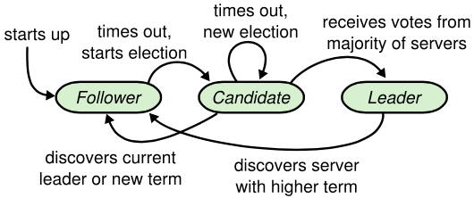

# Purpose

1. Enhance the understandability of Paxos
   - Raft separates the key elements of consensus, such as leader election, log replication, and safety
   - It enforces a stronger degree of coherency to reduce the number of states that must be considered
2. Novel features: strong leader, leader election, membership changes. 
3. **What is the common properties of consensus algorithms?**
   - Safety: never returning an incorrect result under all non-Byzantine conditions, including network delays, partitions, and packet loss, duplica- tion, and reordering.
   - Available as long as any majority of the servers are operational and can communicate with each other and with clients. 
   - They do not depend on timing to ensure the consistency of the logs: faulty clocks and extreme message delays can, at worst, cause availability problems. 
   - A command can complete as soon as a majority of the cluster has responded to a single round of remote procedure calls; a minority of slow servers need not impact overall system performance. 

# Model

## Basics

1. **How does Raft implements consensus overall?**
   - First electing a distin- guished leader, then giving the leader complete responsi- bility for managing the replicated log. 
   - The leader accepts log entries from clients, replicates them on other servers, and tells servers when it is safe to apply log entries to their state machines. 
   - A leader can fail or be- come disconnected from the other servers, in which case a new leader is elected.

2. **What are the states of each server?**
   - At any given time each server is in one of three states: leader, follower, or candidate. 
   - In normal operation there is exactly one leader and all of the other servers are followers. 
   - Followers are passive: they issue no requests on their own but simply respond to requests from leaders and candidates. 
   - The leader handles all client requests. If a client contacts a follower, the follower redirects it to the leader. 
   - The candidate is used to elect a new leader. 

3. **How to divide the terms?**
   - Terms are numbered with consecutive integers. Each election begins a new term. 
   - If an election results in a split vote, the term will end with no leader; a new term with a new election will begin shortly. 
   - Terms act as a logical clock in Raft, and they allow servers to detect obsolete information such as stale leaders. 

4. **How does terms change?**
   - Each server stores a current term number, which increases monotonically over time. 
   - Current terms are exchanged whenever servers communicate; if one server’s current term is smaller than the other’s, then it updates its current term to the larger value. 
   - If a candidate or leader discovers that its term is out of date, it immediately reverts to fol- lower state. 
   - If a server receives a request with a stale term number, it rejects the request. 

### States stored on servers

1. Persistent state on all servers: These states need to be updated on stable storage before responding to RPCs, i.e. communicating with outside. 
   - ``currentTerm``: latest term server has seen (initialized to 0 on first boot, increases monotonically)
   - ``votedFor``: candidateId that received vote in current term (or ``null`` if none)
   - ``log[]``: log entries
2. Volatile state on all servers:
   - ``commitIndex``: index of highest log entry known to be committed (initialized to 0, increases monotonically)
   - ``lastApplied``: index of highest log entry applied to state machine (initialized to 0, increases monotonically)

3. Volatile state on leaders: These states need to be reinitialized after election
   - ``nextIndex[]``: for each server, index of the next log entry to send to that server (initialized to leader last log index + 1)
   - ``matchIndex[]``: for each server, index of highest log entry known to be replicated on server (initialized to 0, increases monotonically)

## Leader election

1. **How does the servers states transit?**

   - When servers start up, they begin as followers. A server remains in follower state as long as it receives valid RPCs from a leader or candidate. 
   - Leaders send periodic heartbeats (AppendEntries RPCs that carry no log entries) to all followers in order to maintain their authority. 
   - If a follower receives no communication over a period of time called the election timeout, then it assumes there is no vi- able leader and become a candidate to initiate a new election. 
   - A candidate that receives votes from a majority of the full cluster becomes the new leader. 

   

2. **How to elect a leader?**

   - To begin an election, a follower increments its current term and transitions to candidate state. 
   - It then votes for itself and issues RequestVote RPCs in parallel to each of the other servers in the cluster. 
   -  Candidate continues in this state until one of three things happens
     - It wins the election
     - Another server establishes itself as leader
     - A period of time goes by with no winner. 

3. **How is the election held?**

   - Each server will vote for at most one candidate in a given term, on a first-come-first-served basis to ensure that at most one candidate can win the election for a particular term. 
   - A candidate wins an election if it receives votes from a majority of the servers in the full cluster for the same term. 
   - Once a candidate wins an election, it becomes leader. It then sends heartbeat messages to all of the other servers to establish its authority and prevent new elections. 

4. **How to determine that a server loses the election?**

   - A candidate may receive an AppendEntries RPC from another server claiming to be leader. 
   - If the leader’s term is at least as large as the candidate’s current term, then the candidate recognizes the leader as legitimate and returns to follower state. 
   - If the term in the RPC is smaller than the candidate’s current term, then the candidate rejects the RPC and con- tinues in candidate state. 

5. **How to handle a split vote?**

   - If many followers become candidates at the same time, votes could be split so that no candidate obtains a majority. 
   - Each candidate will time out and start a new election by incre- menting its term and initiating another round of Request- Vote RPCs. 
   - Raft uses randomized election timeouts to ensure that split votes are rare and that they are resolved quickly. 
     - Election timeouts are chosen randomly from a fixed interval at the start of an election, and it waits for that timeout to elapse before starting the next election. 
     - In most cases only a single server will time out; it wins the election and sends heartbeats before any other servers time out. 

### RequestVote RPC

1. This is invoked by candidates to gather votes
2. Arguments: 
   - ``term``: candidate's term
   - ``candidateId``: candidate requesting vote
   - ``lastLogIndex``: index of candidate's last log entry
   - ``lastLogTerm``: term of candidate's last log entry
3. Results: 
   - ``term``: currentTerm, for candidate to update itself
   - ``voteGranted``: true means candidate received vote
4. Receiver implementation:
   - Reply ``false`` if term < currentTerm
   - If votedFor is ``null`` or ``candidateId``, and candidate's log is at least as up-to-date as receiver's log, grant vote

## Log replication

1. **How is clients request handled?**

   - Each client request contains a command to be executed by the replicated state machines. 
   - The leader appends the command to its log as a new entry, then is- sues AppendEntries RPCs in parallel to each of the other servers to replicate the entry. 
   - When the entry has been safely replicated, the leader applies the entry to its state machine and returns the result of that execution to the client. 
   - If followers crash or run slowly, or if network packets are lost, the leader retries Append- Entries RPCs indefinitely (even after it has responded to the client) until all followers eventually store all log en- tries.

2. **What is stored in a log entry?**

   - A command for state machine
   - A term number when entry was received by leader. 
   - An index to identify its position in the log. The index of the first log is 1. 

3. **How to apply a log entry to the state machines?**

   - The leader decides when it is safe to apply a log en- try to the state machines. 
     - Such an entry is called ``commit- ted``. 
     - Raft guarantees that committed entries are durable and will eventually be executed by all of the available state machines. 
   - A log entry is committed once the leader that created the entry has replicated it on a majority of the servers. 
   - It also commits all preceding entries in the leader’s log, including entries created by previous leaders. 
   - The leader keeps track of the highest index it knows to be committed, and it includes that index in future AppendEntries RPCs, including heartbeats, so that the other servers eventually find out that they should commit some new entries. 
   - Once a follower learns that a log entry is committed, it applies the entry to its local state machine in log order. 

4. **How to determine the consistency between logs?**

   - **Log Matching property**: If two logs contain an entry with the same index and term, then the logs are identical in all entries up through the given index. 

   - The Log Matching property is maintained through the following properties: 

     - If two entries in different logs have the same index and term, then they store the same command. 

     - If two entries in different logs have the same index and term, then the logs are identical in all preceding entries. 

5. **How to check the consistency in AppendEntries RPCs?**

   - When send- ing an AppendEntries RPC, the leader includes the index and term of the entry in its log that immediately precedes the new entries. 
   - If the follower does not find an entry in its log with the same index and term, then it refuses the new entries. 

6. **What kinds of inconsistency may incur?**

   - Leader crashes can leave the logs inconsistent. The old leader may not have fully replicated all of the entries in its log. 
   - A follower may be missing entries that are present on the leader, it may have extra entries that are not present on the leader, or both. 

7. 