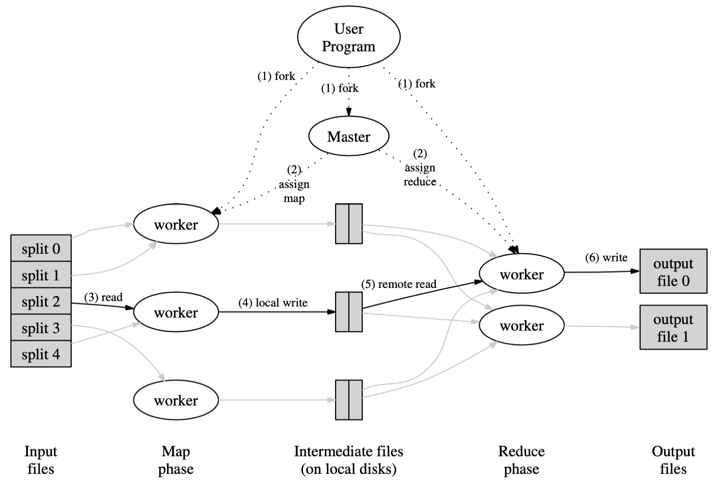

# Purpose

1. Issues: Hard to parallel computation, distribute data, and handle server failures
2. Contribution: Proposed an interface where users only need to write relatively simple Map function and Reduce function, and the system will parallel and distribute automatically. 

# Model

## Paper ideas

1. **What does users need to do? **
   - Users need to provide a Map function and a Reduce function. 

   - Map function will read the original data as key-value pairs, take one pair as input each time, and output intermediate key-value pairs. 
     
     $map(k1,v1)\rightarrow list(k2,v2)$
     
   - Reduce function will take the intermediate-key and a list of all intermediate-values for that key as input, and merge these values to form a smaller set of values. 
     
     $reduce(k2,list(v2))\rightarrow list(v2)$
     
   - When user need to implement the Mapper and Reducer as interface provided by the system, and pass to the MapReduce specification. After passing the input and output files, invoke the ``MapReduce`` function to execute. 

2. **What run-time system need to do? **
   - Partition data

   - Schedule across a set of machines

   - Handle machine failures

   - Manage inter-machine communication. 

3. **How does the system run?** 
   
   When the ``MapReduce`` function is invoked, one **master** process and several **worker** processes will be forked. 
   
   Master will assign work to workers, either a Map work, or a Reduce work. 
   
   Master tries to make most of the ``(3) read`` run locally. In the ``(5) remote read``, network communication is inevitable. 
   
   
4. **What does master need to do? **
   - Master pings every worker periodically, and marks those no response in a certain amount of time as failed. 

   - Track the state of each map task and reduce task (idle, in-progress or completed), and the identity of the worker machine (for non-idle tasks). 

   - $M$ is the number map tasks, while $R$ is the number of reduce tasks. The master must make $O(M+R)$, and keeps $O(M*R)$ state in memory (all map task/reduce task pair). 

5. **How to handle worker failure? **
   - What kinds of worker failure need re-execution? 

     Any task in progress
     
     Completed map tasks also need to be re-executed, since their output is stored on the local disks and is inaccessible. 
     
     Completed reduce tasks don't need to be re-executed, since their output is stored on the global file system. 
     
   - Master will mark the state of those tasks that need re-execution to idle, and can assign them to other workers in the future. 
6. **How to handle master failure? **
   - One way is to make the master write periodic checkpoints of the master data structure. 

   - Given that there is only a single master, its failure is unlikely. Therefore another way is to abort the MapReduce computation if the master fails, and clients can try again later. (This is the way the author takes)
7. **How to partition reduce tasks? **
   The number of reduce tasks/output files ($R$) is specified by the users. The default partitioning uses hashing, namely partition according to $hash(key)\ mod\ R$. 
8. **How to handle straggler problem? **
   Straggler: a machine that takes an unusually long time to complete on of the last few map or reduce tasks. This may be caused by a bad disk, its scheduling system scheduling it a different other tasks. 
   
   So when a MapReduce operation is close to completion, the master schedules backup executions of the remaining in-progress tasks. 

## Reproduce

I have reproduced it as the Lab 1 of MIT 6.824. 

1. 
