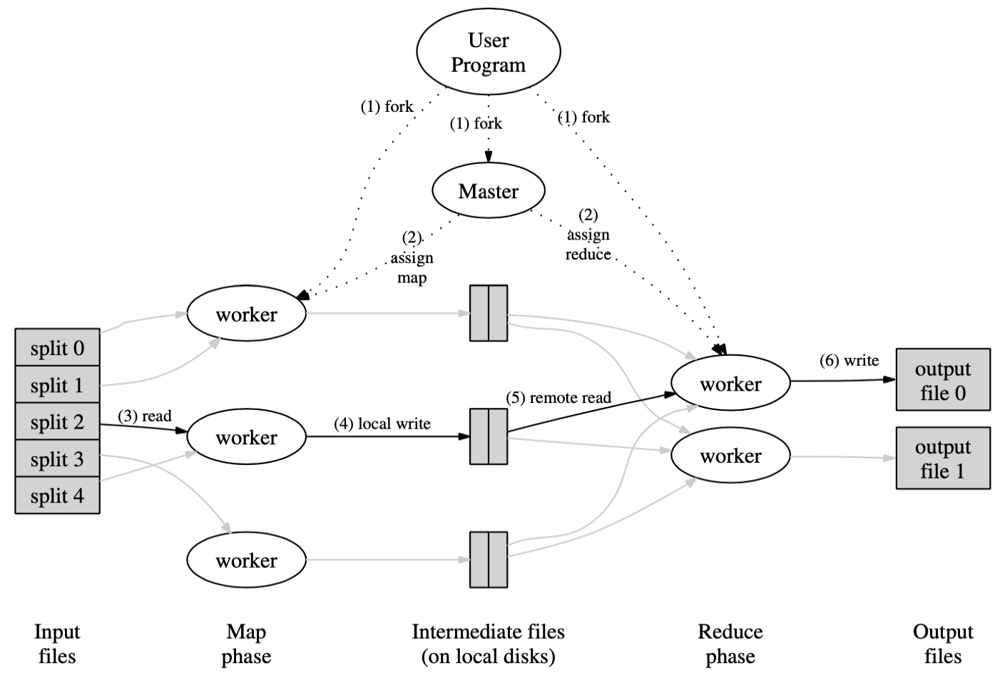
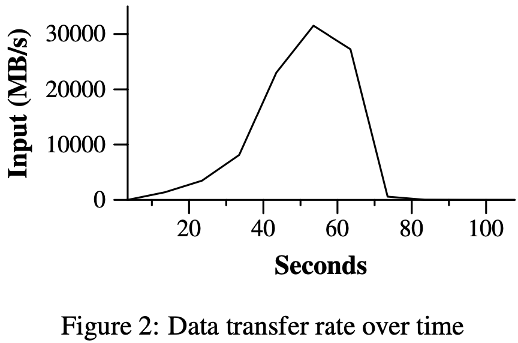
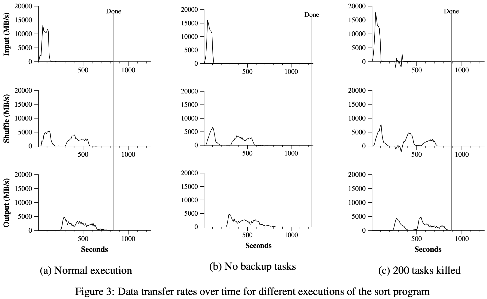

[toc]

# Purpose

1. Issues: Hard to parallel computation, distribute data, and handle server failures
2. Contribution: Proposed an interface where users only need to write relatively simple Map function and Reduce function, and the system will parallel and distribute automatically. 

# Model

## Paper ideas

1. **What does users need to do?**
   
   - Users need to provide a Map function and a Reduce function. 
   
   - Map function will read the original data as key-value pairs, take one pair as input each time, and output intermediate key-value pairs. 
     
     $map(k1,v1)\rightarrow list(k2,v2)$
     
   - Reduce function will take the intermediate-key and a list of all intermediate-values for that key as input, and merge these values to form a smaller set of values. 
     
     $reduce(k2,list(v2))\rightarrow list(v2)$
     
   - Users need to implement the Mapper and Reducer as interface provided by the system, and pass to the MapReduce specification. After passing the input and output files, invoke the ``MapReduce`` function to execute. 
   
2. **What does run-time system need to do?**
   
   - Partition data
   
   - Schedule across a set of machines
   
   - Handle machine failures
   
   - Manage inter-machine communication. 
   
3. **How does the system run?** 
   
   When the ``MapReduce`` function is invoked, one **master** process and several **worker** processes will be forked. 
   
   Master will assign work to workers, either a Map work, or a Reduce work. 
   
   Master tries to make most of the ``(3) read`` run locally. In the ``(5) remote read``, network communication is inevitable. 
   
   
4. **What does master need to do?**
   - Master pings every worker periodically, and marks those no response in a certain amount of time as failed. 

   - Track the state of each map task and reduce task (idle, in-progress or completed), and the identity of the worker machine (for non-idle tasks). 

   - $M$ is the number map tasks, while $R$ is the number of reduce tasks. The master must make $O(M+R)$ scheduling decisions, and keeps $O(M*R)$ state in memory (all map task/reduce task pair). 

5. **How to handle worker failure?**
   
   - What kinds of worker failure need re-execution? 
   
     - Any tasks in progress
     
     - Completed map tasks also need to be re-executed, since their output is stored on the local disks and is inaccessible. 
     
     - Completed reduce tasks don't need to be re-executed, since their output is stored on the global file system. 
     
   - Master will mark the state of those tasks that need re-execution to idle, and can assign them to other workers in the future. 
6. **How to handle master failure?**
   - One way is to make the master write periodic checkpoints of the master data structure. 

   - Given that there is only a single master, its failure is unlikely. Therefore another way is to abort the MapReduce computation if the master fails, and clients can try again later. (This is the way the author takes)
7. **How to partition reduce tasks?**
   The number of reduce tasks/output files ($R$) is specified by the users. The default partitioning uses hashing, namely partition according to $hash(key)\ mod\ R$. 
8. **How to handle straggler problem?**
   
   Straggler: a machine that takes an unusually long time to complete on of the last few map or reduce tasks. This may be caused by a bad disk, its scheduling system scheduling it a different other tasks. 
   
   So when a MapReduce operation is close to completion, the master schedules backup executions of the remaining in-progress tasks. 

## Reproduce

This reproduce part is based on the Lab 1 of MIT 6.824. 

1. **How do we assign map tasks?**

   Each worker will request for more map tasks when it becomes idle, and the master will assign files directly to them. 

2. **How do we assign reduce tasks?**

   When worker is notified that there is no more map tasks, they will begin to request for reduce tasks. This time, the master won't assign files directly, instead, master will only assign a number in the range from $0$ to $R-1$. Then each worker will try to read intermediate files from each workers according to its number automatically. 

   This requires those map workers store their output in a previously agreed file name for reduce workers to request. 

3. **When can workers stop requesting for more map tasks/reduce tasks?**

   - Only after all map tasks is completed, workers can stop requesting for more map tasks and begin to request for reduce tasks, since reduce tasks may depend on those unfinished map tasks. So the lifecycle of workers can be partitioned into two phase, the map phase and the reduce phase.

   - Also, only after all reduce tasks is completed, workers can stop requesting for more reduce tasks and quit the program. This is because those executing, yet uncompleted, tasks may fail, and when that happens, we need other workers to re-execute those tasks. 

   - Similarly, reduce workers cannot delete those intermediate files right after they read them. Because if they fail, their successor need to read those files. 

# Experiments and results

1. **What to notice when configurate cluster?**
   - Need to reserve some memory for other tasks running on the cluster. The author reserved $1-1.5$ GB out of $4$ GB. 
   - Best test when the CPUs, disks, and network were mostly idle. 
2. The author tested two representative situations, grep and sort. 
3. In the grep test, the execution time includes a minute of startup overhead over $150$ seconds of total time. The overhead is due to the propagation of the program to all worker machines, and delays interacting with GFS to open the set of input files and to get the information needed for the locality optimization. 

   
4. In the sort test, 
   - It only consists of less than $50$ lines of user code
   - The entire computation time including startup overhead is similar to the best reported result at that time. 
   - The author tested three kind of rates, the rate of reading by map workers (*input rate*), the rate of communicating intermediate files between map workers and reduce workers (*shuffle rate*), and the rate of writing output files by reduce workers (*output rate*). These are the I/O parts which affect the perfornmence significantly. 
     - The input rate is less than for grep, because sort map tasks spend more time writing intermediate output to their local disks. 
     - The input rate is higher than the shuffle rate and the output rate because of locality optimization. 
     - The shuffle rate is higher than the output rate because the output phase writes replicas due to the mechanism for reliability  of the underlying file system. 
   - The author also tested when $200$ out of $1746$ workers are killed several minutes. The underlying cluster scheduler immediately restarted new worker processes on these mechines (only the processes were killed, the machines were still functioning properly). The entire computation time increases of $5\%$ over the normal execution time. 
   
   

